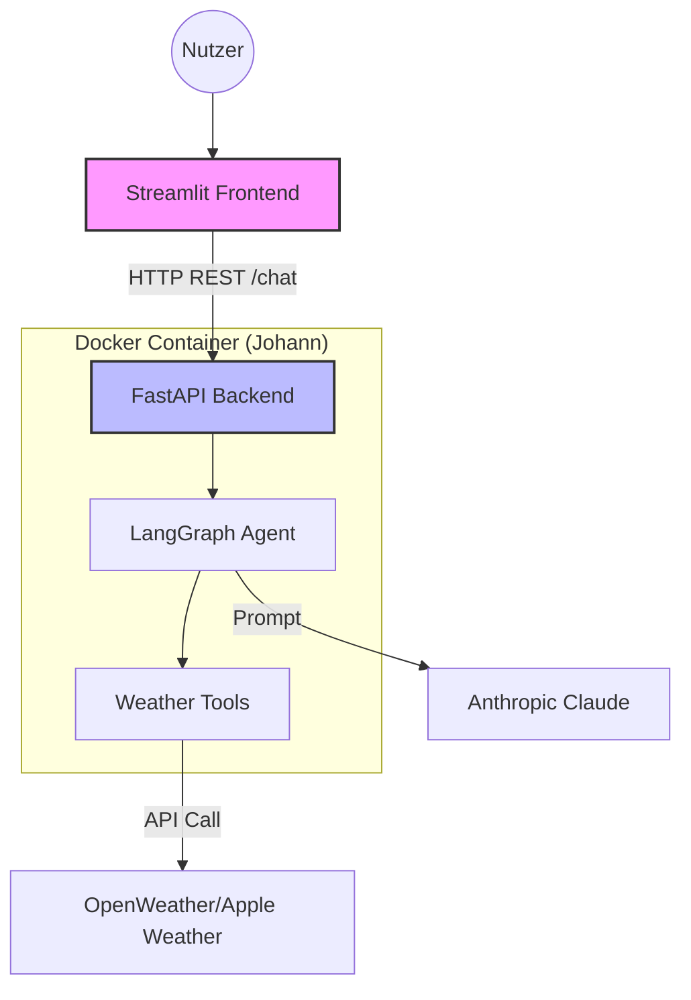

# 🌤️ Munich Weather Butler (Distributed Version)

A decoupled AI Agent system using **FastAPI** as the backend service and **Streamlit** as the web frontend. The agent ("Johann") processes requests via a REST API.

---

### 📁 Project Structure

| File | Responsibility |
| :--- | :--- |
| **`api_server.py`** | **Backend (FastAPI)**: Hosts the REST API and runs the Agent logic. |
| **`weather_gui.py`** | **Frontend (Streamlit)**: User interface that communicates with the API. |
| **`weather_agent.py`**| **Agent Logic**: The main entry point for the LangGraph agent definition. |
| **`agent_core.py`** | **Orchestration**: Helper functions for LLM setup and memory management. |
| **`weather_tools.py`** | **Capabilities**: Dynamic weather, geocoding & **timezone-aware** local time. |

---

## 🏗 Architektur



---

## 🚀 How to Run

### 1. Setup & Config
```bash
# Install dependencies
pip install -r requirements.txt

Ensure .env contains: ANTHROPIC_API_KEY=your_key

# create git tag to trigger gh action
git tag -a v0.1.0 -m "Release 0.1.0"
git push origin v0.1.0  
``` 

### 2. Run Backend
```bash
Standalone: uvicorn api_server:app --reload --port 8000
Docker: docker compose up -d
``` 

### 3. Run Frontend
```bash
streamlit run weather_gui.py
``` 

### 3. Test Backend Agent if running in docker
```bash
curl -X POST http://localhost:8000/chat -H "Content-Type: application/json" -d '{"message": "Wie ist das Wetter in München?"}'
``` 


